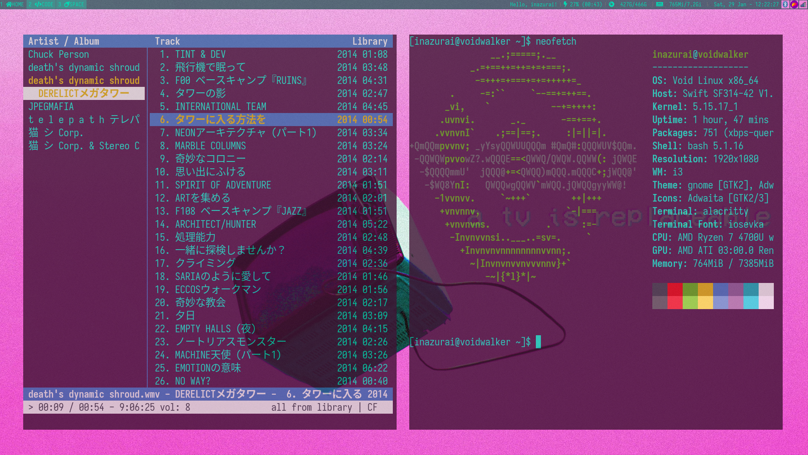

# vapor-dotfiles
**Package list included.**

*Installation instructions:*

git clone https://github.com/inazurai/vapor-dotfiles/

sudo xbps-install -S $(packagelist.txt)

cp -r vapor-dotfiles/.config ~

